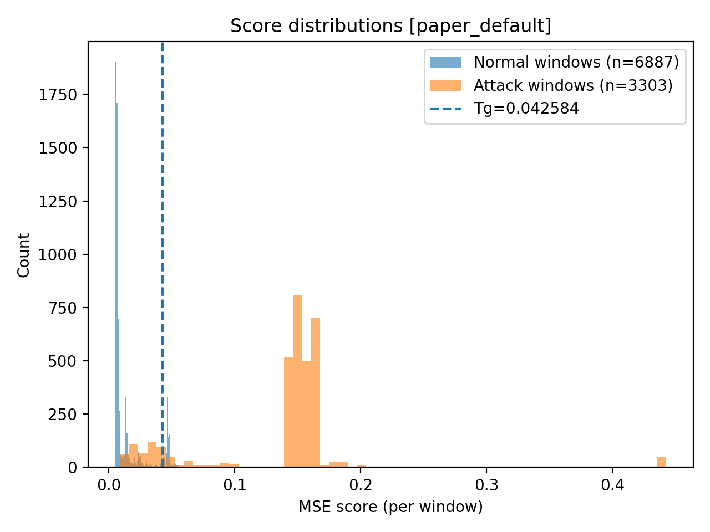

# Implementation of DAICS on SWaT

A university project implementing **DAICS** for anomaly detection on the **SWaT** dataset, as described by Abdelaty et al. in their 2021 IEEE paper "DAICS: A Deep Learning Solution for Anomaly Detection in Industrial Control Systems".

## Overview

This repository provides a **paper-aligned reproduction** of the DAICS architecture for industrial anomaly detection on the SWaT dataset.

The complete pipeline includes:

1. **WDNN (Weighted Deep Neural Network)**  
   → Multi-step time-series prediction model trained on *normal-only* data.

2. **TTNN (Threshold Tuning Neural Network)**  
   → Learns the dynamics of prediction errors on validation data.

3. **Adaptive threshold tuning (Algorithm 1)**  
   → Computes section-wise decision thresholds.

4. **Window-level detection with W<sub>anom</sub> logic**  
   → Reduces false alarms by enforcing anomaly persistence.

The implementation strictly follows the notation of the paper.

---

# I. Full Pipeline

## Data Protocol Used

- **Training set** → Normal data only  
- **Validation set** → Normal data only  
- **Test set** → Mixed scenario (tail of normal + attack)

By default, the test set uses the last **7000 normal rows** from the normal parquet, then appends **all attack rows** from the attack parquet.

Attacks indeed represent ≈ 5.13% of the test set. This number of rows was chosen to be close to the overall attack ratio in the complete SWaT timeline (≈ 4.95%).

## 1. Preprocessing the SWaT dataset (optional)
The code already contains the processed parquet files, **so you can skip preprocessing**.

If you want to do it by yourself, you should download the official SWaT CSV files:

- `normal.csv`
- `attack.csv`

Place them inside the */data* folder and run the following command: 
```bash
python scripts/preprocess_swat.py --config configs/base.yaml
```

## 2. Sanity Check Windowing
```bash
python scripts/sanity_check_windows.py --config configs/base.yaml
```
You might see *"UserWarning: 'pin_memory' argument is set as true but no accelerator is found"*, it simply means CUDA is not available and it is safe to ignore.

## 3. Train WDNN Model
```bash
python scripts/train_wdnn.py --config configs/base.yaml
```
*Number of epochs:* **100**

*Outputs:*
- *runs/wdnn/best.pt*
- *runs/wdnn/last.pt*

*best.pt* is the checkpoint with best validation loss while *last.p*t is the final epoch model. You should use *best.pt* for detection.

## 4. Train TTNN
```bash
python scripts/train_ttnn.py --config configs/base.yaml --wdnn_ckpt runs/wdnn/best.pt
```

*Number of epochs:* **1**

*Output: runs/ttnn/section_0.pt*

We use *G = 1* section (all sensors grouped).

## 5. Tune Thresholds (Algorithm 1 and 2)
```bash
python scripts/tune_thresholds.py --config configs/base.yaml --wdnn_ckpt runs/wdnn/best.pt --ttnn_ckpt runs/ttnn/section_0.pt
```

*Output: runs/thresholds.json*

This script implements Algorithm 1 from the paper by computing the adaptive decision threshold T<sub>g</sub>, using the validation prediction error dynamics modeled by the TTNN.

## 6. Evaluate Detection
```bash
python scripts/eval_detect.py --config configs/base.yaml --wdnn_ckpt runs/wdnn/best.pt --thresholds runs/thresholds.json
```

This prints:
- Raw threshold metrics
- Wanom-filtered metrics
- Confusion matrices
- Score statistics

# II. Results

## 1. Model Hyperparameters and Evaluation Metrics
*Note: We reuse the sames values as defined in the paper*
<table>
<tr>
<td valign="top" width="50%">

<h3>Window Parameters</h3>

| Parameter | Value |
|------------|--------|
| W<sub>in</sub> | 60 |
| W<sub>out</sub> | 4 |
| H | 50 |
| S | 1 |
| W<sub>anom</sub> | 30 |
| W<sub>grace</sub> | 0 |

</td>
<td valign="top" width="50%">

<h3>WDNN Hyperparameters</h3>

| Parameter | Value |
|------------|--------|
| Optimizer | SGD |
| Learning rate | 0.001 |
| Epochs | 100 |
| Loss | MSE |
| DL1 neurons | 3 × W<sub>in</sub> |
| DL2 neurons | 3 × m |
| DL4 neurons | 80 |
| CL1 channels | 64 |
| CL1 kernel size | 2 |
| CL2 channels | 128 |
| CL2 kernel size | 2 |
| Activation | LeakyReLU (0.01) |

</td>
</tr>

<tr>
<td valign="top" width="50%">

<h3>TTNN Hyperparameters</h3>

| Parameter | Value |
|------------|--------|
| Optimizer | SGD |
| Learning rate | 0.01 |
| Epochs | 1 |
| Batch size | 32 |
| Median kernel | 59 |
| Activation | LeakyReLU (0.01) |

</td>
<td valign="top" width="50%">

<h3>Detection Performance (Window-Level)</h3>

| Mode | Precision | Recall | F1-score |
|------|----------|--------|----------|
| Raw threshold | 0.7649 | 0.8707 | 0.8144 |
| After W<sub>anom</sub> | 0.8819 | 0.8365 | 0.8586 |

</td>
</tr>
</table>

Applying Wanom significantly reduces false positives while maintaining a high detection rate. This increases precision from 0.76 to 0.88 with only a moderate decrease in recall, leading to a higher overall F1-score and a more stable industrial detection behavior.
## 2. Score Distributions

<h3 align="center"></h3>
<p align="center">
  
</p>

## 3. Plots

To generate analysis plots:
```bash
python scripts/plot_detection_analysis.py --config configs/base.yaml --wdnn_ckpt runs/wdnn/best.pt --thresholds runs/thresholds.json --tag paper_default --out_dir runs/plots
```
*Outputs: runs/plots/*

## Project Structure
```
daics-swat/
│
├── configs/
│   └── base.yaml                      # Global configuration file
│
├── data/
│   ├── normal.csv                     # Original SWaT normal CSV
│   ├── attack.csv                     # Original SWaT attack CSV
│   ├── processed_swat_normal.parquet
│   └── processed_swat_attack.parquet
│
├── scripts/
│   ├── preprocess_swat.py             # CSV → Parquet preprocessing
│   ├── sanity_check_windows.py        # Validates window shapes and splits
│   ├── train_wdnn.py                  # WDNN training
│   ├── train_ttnn.py                  # TTNN training
│   ├── tune_thresholds.py             # Threshold computation (Algorithm 1 and Algorithm 2)
│   ├── eval_detect.py                 # Final detection evaluation
│   └── plot_detection_analysis.py     # Plot generation
│
├── src/daics/
│   ├── models/
│   │   ├── wdnn.py                    # WDNN architecture
│   │   └── ttnn.py                    # TTNN architecture
│   ├── train/
│   │   ├── wdnn_trainer.py            # WDNN training loop
│   │   └── ttnn_trainer.py            # TTNN training loop
│   ├── eval/
│   │   ├── mse.py                     # MSE computation
│   │   ├── thresholds.py              # Threshold tuning logic
│   │   └── detect.py                  # Wanom detection logic
│   └── data/
│       ├── swat.py                    # SWaT-specific utilities
│       ├── dataloaders.py             # Paper-strict splits
│       └── windowing.py               # Sliding window logic
│
├── runs/                              # Checkpoints & outputs
│   ├── wdnn/
│   ├── ttnn/
│   └── thresholds.json
│
├── requirements.txt
└── README.md
```

## References
